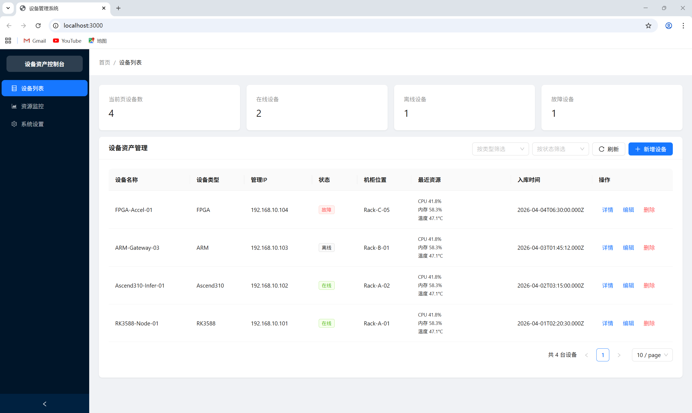
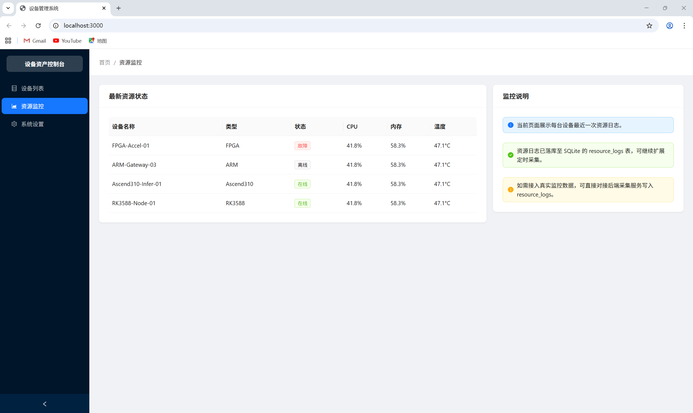
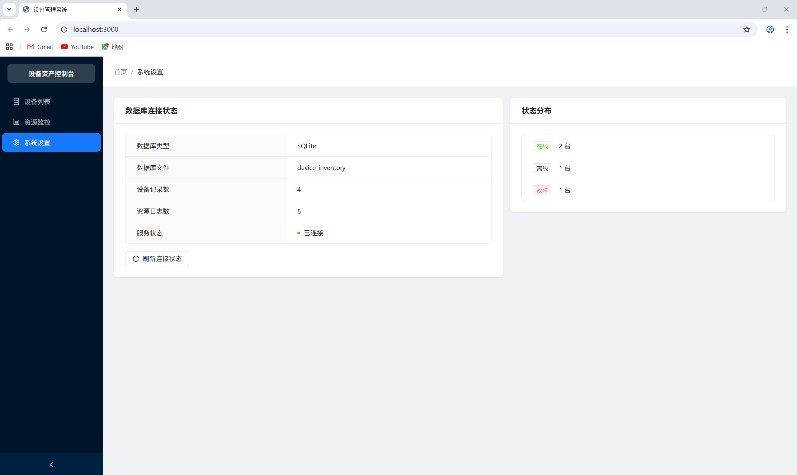

# 异构设备资产与状态管理系统

本项目旨在构建一套轻量级且可扩展的异构设备资产与状态管理系统，专门用于管理包含 RK3588、昇腾 310、ARM 及 FPGA 等多种硬件的计算资源池。

## 已完成功能

### 1. 数据库设计与建模 (MySQL)
- **设备基础表 (devices)**：存储设备通用信息（ID, 名称, 类型, 管理IP, 位置, 状态, 入库时间）。
- **扩展属性设计**：使用 MySQL 原生 `JSON` 字段存储异构设备的特有参数（如 FPGA 的芯片型号、Ascend 的算力规格等）。
- **资源日志表 (resource_logs)**：记录设备的历史资源状态（CPU、内存、温度、时间戳）。
- **自动初始化**：后端启动时会自动创建数据库和表，并进行初始数据填充。

### 2. 后端 API 开发 (Express + MySQL)
- **设备管理 (CRUD)**：
    - `GET /api/devices`：分页查询设备列表，支持按类型和状态筛选。
    - `GET /api/devices/:id`：获取单个设备详情及其历史资源日志。
    - `POST /api/devices`：新增设备，包含 IP 唯一性校验。
    - `PUT /api/devices/:id`：更新设备基础信息及扩展属性。
    - `DELETE /api/devices/:id`：物理删除设备。
- **系统状态**：
    - `GET /api/health`：获取数据库连接状态、设备总数及状态分布统计。

### 3. 前端管理界面 (Vue 3 + Ant Design Vue)
- **响应式布局**：包含侧边栏导航、面包屑和主体内容区。
- **设备列表视图**：展示设备核心参数，使用彩色标签区分在线/离线/故障状态。
- **动态表单技术**：根据选择的设备类型，动态展示对应的硬件特有参数输入框（RK3588/Ascend310/ARM/FPGA）。
- **资产详情抽屉**：以抽屉形式展示设备全量属性及资源日志时间线。

## 项目文件结构

```text
device_management/
├── server/                 # 后端逻辑目录
│   └── index.js            # Express 服务入口，包含数据库初始化与 API 路由
├── src/                    # 前端源代码目录
│   ├── App.vue             # 前端主组件，包含布局、列表及表单逻辑
│   └── main.js             # Vue 项目入口
├── dist/                   # 前端编译后的静态资源（打包生成）
├── .env                    # 数据库连接配置文件（需手动配置密码）
├── index.html              # 前端页面入口
├── package.json            # 项目依赖与脚本配置
├── vite.config.js          # Vite 构建配置
└── README.md               # 项目说明文档
```

## 未来功能建议

1.  **实时资源监控大屏**：
    - 接入 WebSocket 实现设备 CPU、内存、温度的实时数据流推送。
    - 使用 ECharts 或 G2Plot 绘制实时的资源占用趋势曲线。

2.  **设备固件/比特流远程分发**：
    - 支持针对 FPGA 的比特流文件或 ARM/RK3588 的固件包进行上传与远程下发更新。
    - 记录固件更新历史与版本回滚功能。

## 工作截图





## 运行指南

1.  **配置数据库**：
    修改 `.env` 文件中的 `DB_PASSWORD` 为您本地 MySQL 的真实密码。
2.  **启动后端**：
    ```bash
    npm run server
    ```
3.  **启动前端**：
    ```bash
    npm run dev
    ```
